# HRMS Leave Management System

This is a web-based Leave Management System built using HTML, CSS, and JavaScript.

## Features
- Admin Dashboard
- Employee Sign-Up/Login
- Leave Request and Approval
- Real-time Leave Status Updates

## How to Run the Project
1. Download or clone the repository.
2. Open `index.html` in any browser.
3. Navigate using the homepage menu to access Admin or Employee sections.

## Learning Outcomes
- Built responsive layouts using HTML & CSS
- Implemented form validations and dynamic updates with JavaScript
- Learned project structuring and file management

## Author
Srivarshini Uppaluru

## Output Screenshots
 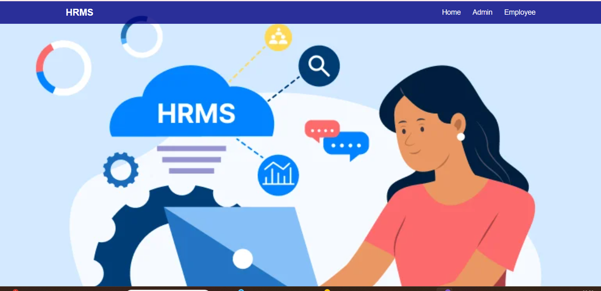
 
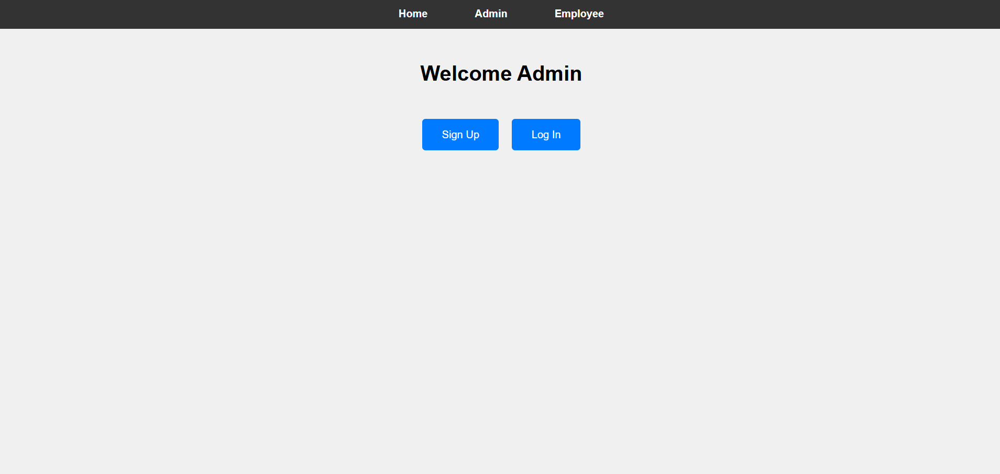
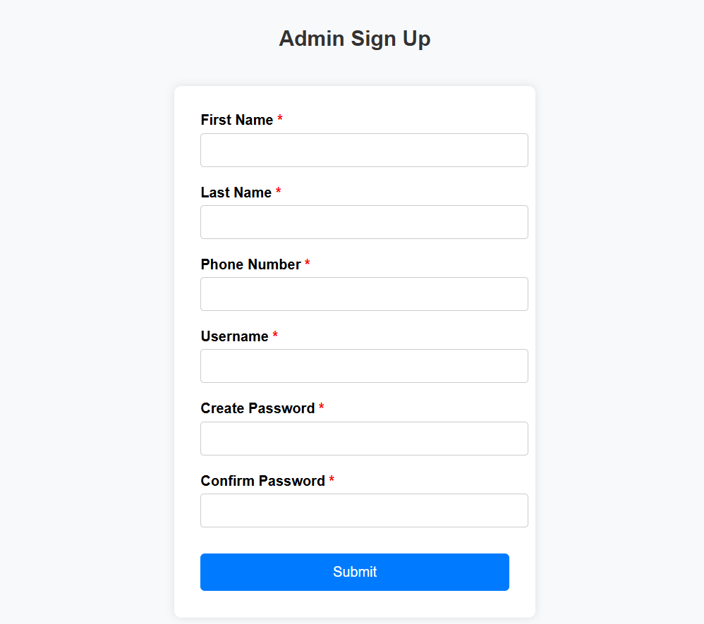
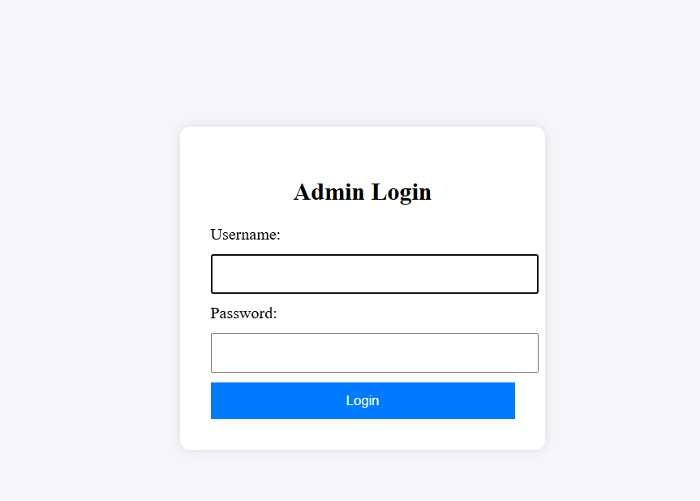 
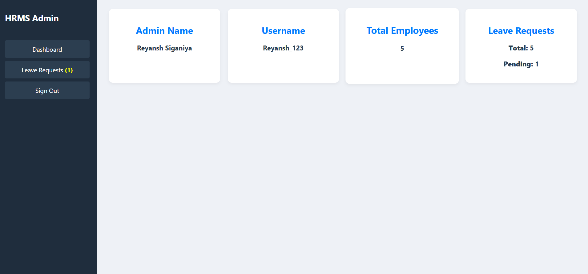
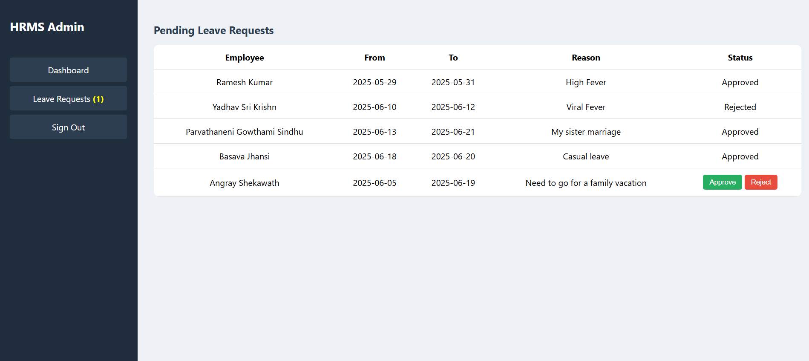 
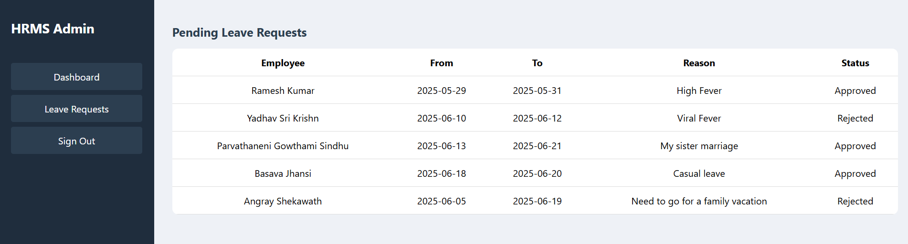 
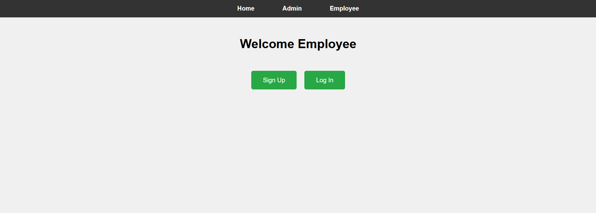 
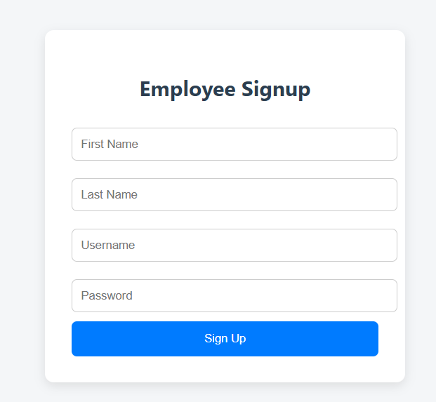
 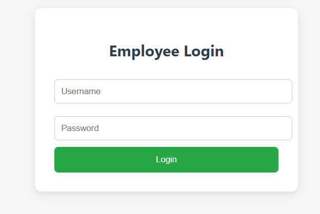
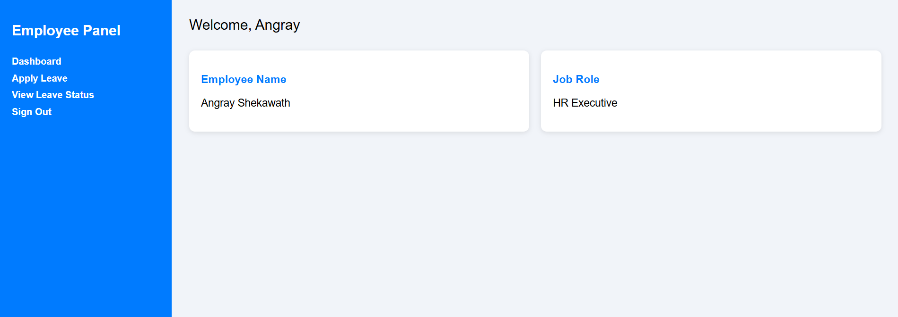 
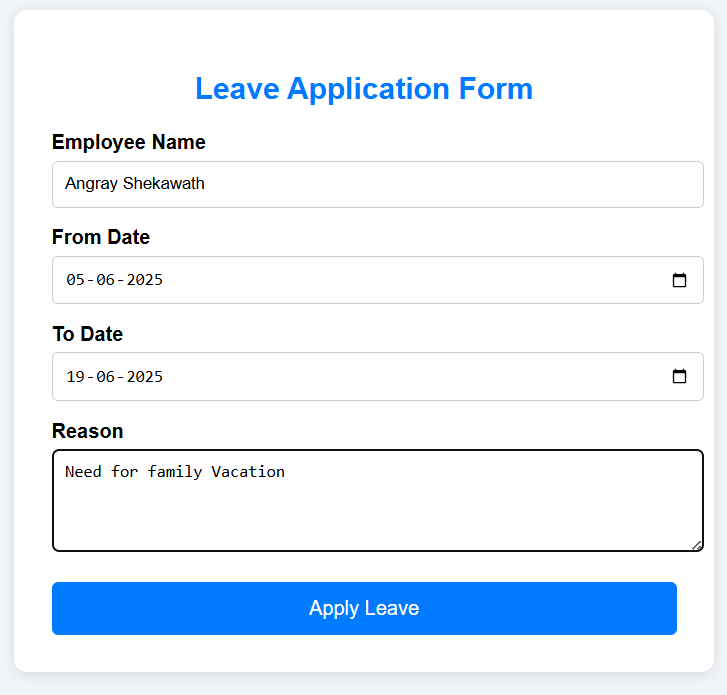
 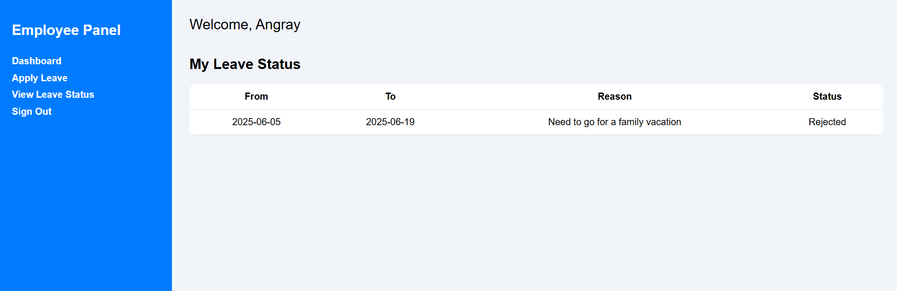 
 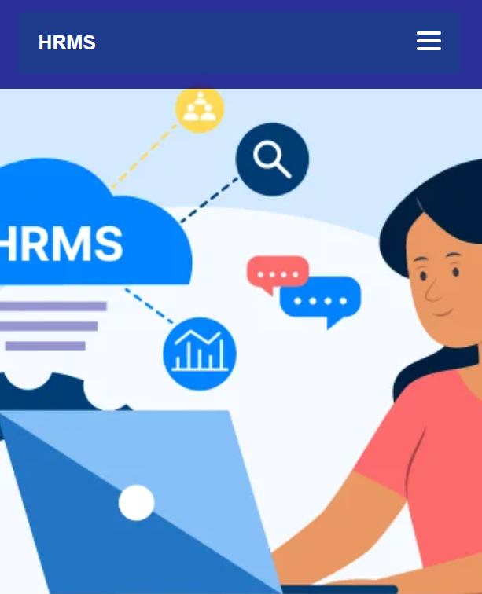
  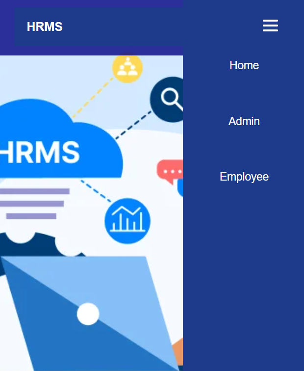
  After the process is same where admin can signup, login, view, approve, disapprove leave request of an employee and Employee can signup, login, view his details, apply for leave, view his leave status that is functionality same for both desktop and mobile devices.

  ## Conclusion
  The HRMS Leave Management System showcases the development of a fully responsive, interactive web application using HTML, CSS, and JavaScript. Built during a self-paced internship at VeriTech Software IT Services, this project addresses manual leave management challenges with a structured digital solution.

  Through this experience, I gained practical skills in front-end architecture, UI design, and local data handling. It also strengthened my ability to work independently and manage a project end-to-end. This internship laid a strong foundation for my future in software development and real-time application building.